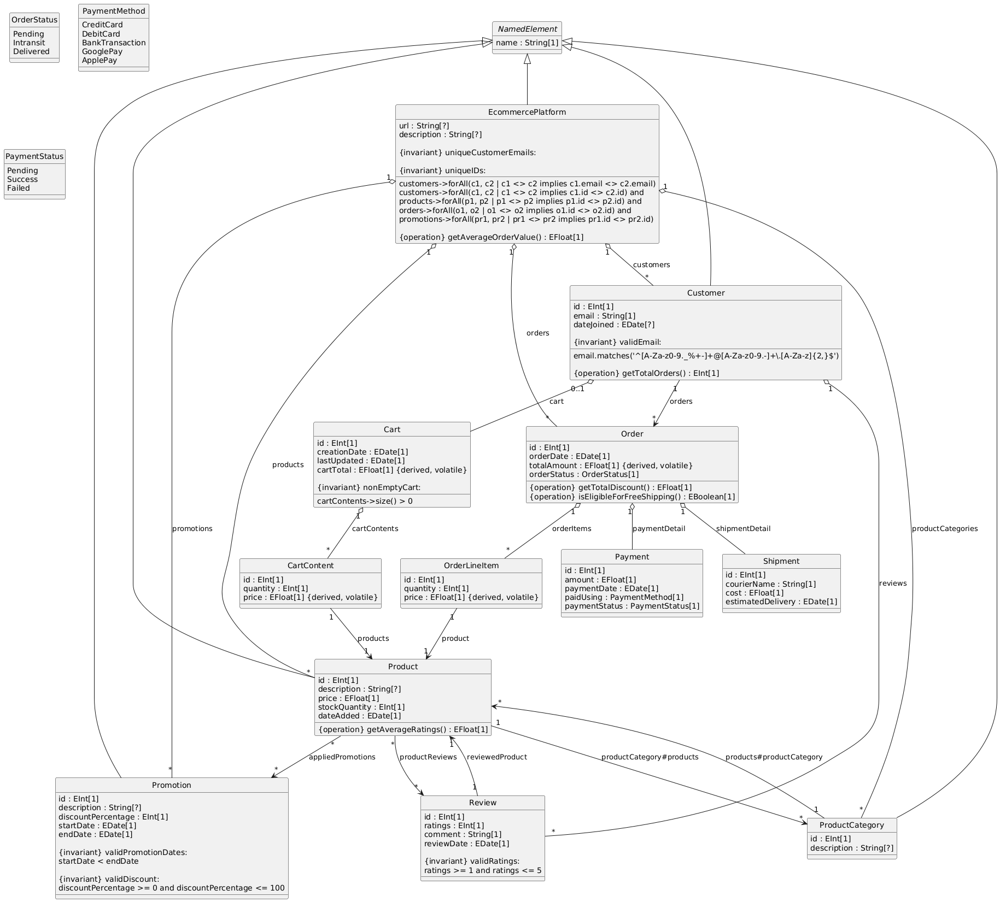

# E-Commerce Platform Model Implementation using EMF

## 1. Introduction

This is an **E-Commerce platform metamodel** developed using the **Eclipse Modeling Framework (EMF)**. The model is designed to capture the core components of an e-commerce system, including:

- Customers
- Products
- Orders
- Promotions

The model enforces data consistency through constraints, dynamically computes key metrics with derived fields, and supports business logic through operations. A UML diagram (Figure 1) provides a visual representation of the model's structure and relationships.

---

## 2. Model Description

The core components of the model are as follows:

### **EcommercePlatform**

- Aggregates customers, products, product categories, orders, and promotions.
- **Operations**: Calculates the average value of all orders placed.

### **Customer**

- Represents users with unique IDs and email addresses.
- Capabilities: Place orders, leave reviews, maintain a shopping cart.
- Ensures email addresses are in a valid format.

### **ProductCategory**

- Groups products into categories such as electronics or clothing.

### **Product**

- Defines items for sale, including price, stock quantity, and date added.
- **Operation**: Calculates the average rating based on reviews.
- Can belong to one category and have multiple promotions.

### **Order**

- Tracks customer purchases, products, payment, and shipment details.
- **Operations**:
  - Computes total discounts.
  - Determines eligibility for free shipping.

### **Payment**

- Records payment details: amount, date, method, and status.

### **Shipment**

- Contains shipment details: courier name, shipping cost, and delivery date.

### **Cart**

- Temporarily stores items before checkout.
- Dynamically computes the total value of items and ensures it is not empty.

### **CartContent**

- Represents individual cart items: product, quantity, and price.
- Price accounts for promotions.

### **Review**

- Enables customers to provide feedback.
- Includes rating (1-5), comments, and review dates.

### **OrderLineItem**

- Represents items in an order with quantity and derived price.

### **Promotion**

- Defines discounts or special offers for products.
- Constraints ensure valid dates and discount ranges (0–100%).

---

## 3. Constraints

The following constraints enforce data consistency:

- All IDs (customers, products, orders, promotions) are **unique**.
- Customer email addresses must follow a **valid format**.
- Promotions must have a **start date** earlier than the end date.
- Discounts must range between **0% and 100%**.
- Shopping carts **cannot be empty**.
- Product reviews must have ratings in the range **1–5**.

---

## 4. Derived Fields

The model includes dynamically computed fields:

- **Order Total Amount**: Sum of product prices and quantities.
- **Cart Total**: Total value of items in the cart.
- **Cart Content Price**: Calculated considering promotions.
- **Order Line Item Price**: Derived from product price and quantity.

---

## 5. Operations

Key operations implemented in the model include:

- **EcommercePlatform**: Calculates the average value of all orders.
- **Customer**: Computes the total number of orders placed.
- **Product**: Calculates the average rating based on reviews.
- **Order**:
  - Computes total discounts.
  - Checks eligibility for free shipping.

---

## 6. Plugin Project: `it.univaq.disim.mde.course.assignment.four.business`

The implementation consists of two main plugin projects:

1. **Modeling Project**:

   - Defines the e-commerce metamodel and generates Java APIs using the `.genmodel`.

2. **Business Plugin**:
   - Imports the modeling project and interacts with the generated APIs programmatically.
   - Implements the following functionalities:
     - **Create**: Builds a fully instantiated `EcommercePlatform` model with realistic data.
     - **Serialize**: Saves the model to an `.xmi` file for persistence.
     - **Load**: Reloads the model from the `.xmi` file to verify correctness.
     - **Validate**: Ensures adherence to business rules using **OCL constraints**.

---

## Figure 1: UML Diagram _Generated using PlantUML._

---

## Summary

This project demonstrates the implementation of an **E-Commerce Platform** metamodel using EMF. It showcases various key components, constraints, derived fields, and operations essential to model and manage an e-commerce system effectively.

---
